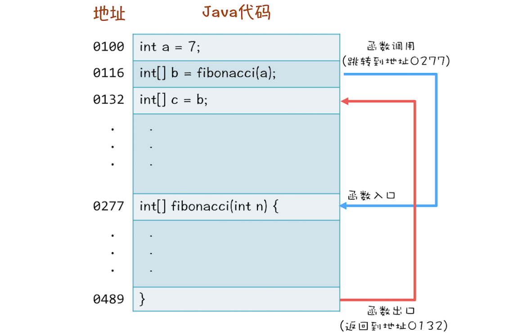
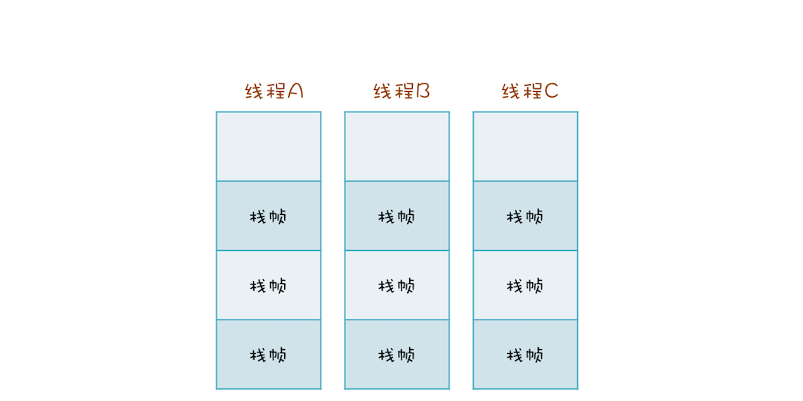

[toc]

## 11 | Java 线程（下）：为什么局部变量是线程安全的？

### 问题

1.  **Java 方法里面的局部变量是否存在并发问题呢**？

2.  一个计算斐波那契数列的方法，数据 r 是否存在数据竞争呢？

    -   ```java
        
        // 返回斐波那契数列
        int[] fibonacci(int n) {
          // 创建结果数组
          int[] r = new int[n];
          // 初始化第一、第二个数
          r[0] = r[1] = 1;  // ①
          // 计算2..n
          for(int i = 2; i < n; i++) {
              r[i] = r[i-2] + r[i-1];
          }
          return r;
        }
        ```

3.  其实，很多人是知道局部变量不存在数据竞争的，至于原因？？？

### 方法是如何被执行的

1.  在CPU层面，方法是**如何调用的**？

    -   Java 代码

    -   ```java
        
        int a = 7；
        int[] b = fibonacci(a);
        int[] c = b;
        ```

    -   方法的调用过程

    -   

2.  CPU 去哪里找到这个调用方法的参数和返回地址？

    -   **通过 CPU 的堆栈寄存器**。CPU 支持一种栈结构，先入后出，常被称为**调用栈**。

3.  如，有三个方法 A/B/C，它们的调用关系是 A->B->C（A 调用 B，B 调用 C）。**调用栈结构**如下：

    -   

### 局部变量存哪里？

1.  方法内的局部变量存哪里？
    -   局部变量的作用域是方法内部。
    -   局部变量应该和方法同生共死。
    -   调用栈的栈帧和方法同生共死。
    -   **局部变量就是放到了调用栈里**。
2.  此时，**保护局部变量的调用栈结构**如下
    -   

### 调用栈与线程

1.  调用栈和线程之间是什么关系呢？
    -   答案是：**每个线程都有自己独立的调用栈**。
    -   如下：线程和调用栈的关系图
    -   
2.  回到本文开头问题：**Java 方法里面的局部变量是否存在并发问题**？
    -   每个线程都有自己的调用栈，局部变量保存在线程各自的调用栈里面，不会共享，所以自然没有并发问题。
    -   **没有共享，就没有伤害**。

### 线程封闭

1.  方法里的局部变量，因为不会和其他线程共享，所以没有并发问题。
2.  **线程封闭**：**仅在单线程内访问数据**。

### 总结 

1.  经验杂谈：**很多技术实现原理都是靠推断，然后看源码验证**。

