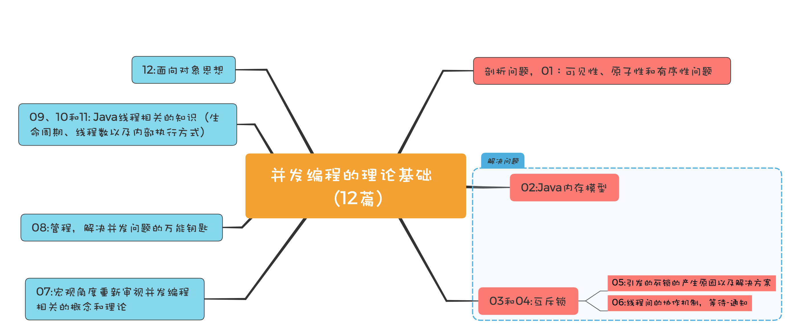

[toc]

## 13 | 理论基础模块热点问题答疑

### “串行”的故事

1.  起源：**CPU 与内存、I/O 的速度差异**。
2.  系统软件（操作系统、编译器）在解决这个核心矛盾的同时，引入**可见性、原子性和有序性**问题（Bug 之源）。 -- chapter 1
3.  为解决这三个问题，Java 语言提供了 **Java 内存模型和互斥锁**方案。
    -   chapter 2，介绍了 Java 内存模型，以应对可见性和有序性问题。
    -   chapter 3/4，介绍了互斥锁，来解决原子性问题。
4.  互斥锁带来**死锁**问题，chapter 5 介绍了死锁。同步引出一个**线程协作**的问题，chapter 6，介绍线程协作机制：等待-通知。
5.  chapter 7，站在宏观的角度重新审视**并发编程相关概念和理论**。
6.  chapter 8，介绍了**管程**，是 Java 并发编程技术的基础，是解决并发问题的万能钥匙。
7.  chapter 9/10/11，介绍了**线程**相关知识。
8.  chapter 12 介绍了**如何用面向对象思想写好并发程序**。
9.  并发编程理论基础模块思维导图
    -   

### 1. 用锁的最佳实践

1.  如何创建正确的锁？

    -   一个合理的受保护资源与锁之间的关联关系应该是 **N:1**。只有**共享一把锁**才能起到互斥作用。
    -   基本原则：锁，应是**私有的、不可变的、不可重用的**。

2.  最佳实践

    -   ```java
        
        // 普通对象锁
        private final Object 
          lock = new Object();
        // 静态对象锁
        private static final Object
          lock = new Object(); 
        ```

### 2. 锁的性能要看场景

1.  基本原则
    -   **没有通吃的技术和方案**，因为每种技术和方案都有优缺点和适用场景的。

### 3. 竞态条件需要格外关注

1.  竞态条件问题非常容易被忽略，contains() 和 add() 方法虽然都是线程安全的，但是组合在一起却不是线程安全的。

2.  参考 chapter 12，需要将共享变量封装在对象的内部，而后控制并发访问的路径。

    -   ```java
        
        class SafeVector{
          private Vector v; 
          // 所有公共方法增加同步控制
          synchronized 
          void addIfNotExist(Object o){
            if(!v.contains(o)) {
              v.add(o);
            }
          }
        }
        ```

### 4. 方法调用是先计算参数

1.  如下写日志代码，如果日志级别设为 INFO，虽然这行代码不会写日志，但会计算 "The var1：" + var1 + ", var2:" + var2 的值。

    -   ```java
        
        logger.debug("The var1：" + 
          var1 + ", var2:" + var2);
        ```

2.  更好的写法，使用 **{} 占位符**。这种写法仅仅是将参数压栈，并不计算。

    -   ```java
        
        logger.debug("The var1：{}, var2:{}", 
          var1, var2);
        ```

### 5. InterruptedException 异常处理需小心

1.  chapter 9 思考题代码

    -   ```java
        
        Thread th = Thread.currentThread();
        while(true) {
          if(th.isInterrupted()) {
            break;
          }
          // 省略业务代码无数
          try {
            Thread.sleep(100);
          }catch (InterruptedException e){
            e.printStackTrace();
          }
        }
        ```

2.  当其他线程调用 th.interrupt() 来中断 th 线程时，大概率会触发 InterruptedException 异常。在触发 InterruptedException 异常的同时，**JVM 会同时把线程的中断标志位清除**。这时，th.isInterrupted() 返回是 false。正确处理方式如下：

    -   ```java
        
        try {
          Thread.sleep(100);
        }catch(InterruptedException e){
          // 重新设置中断标志位
          th.interrupt();
        }
        ```

### 6. 理论值 or 经验值

1.  chapter 10思考题中的经验值是否合理？
    -   理论上来讲，经验值一定靠不住的，但有时，却是一个**很好的初始值**。
2.  工程中，一般都是根据线程数如何影响吞吐量和延迟来在**初始值的基本上做增加**。

### 总结

1.  **学好理论有思路、关注细节定成败**。

