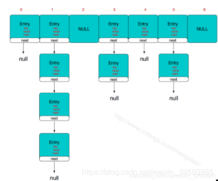
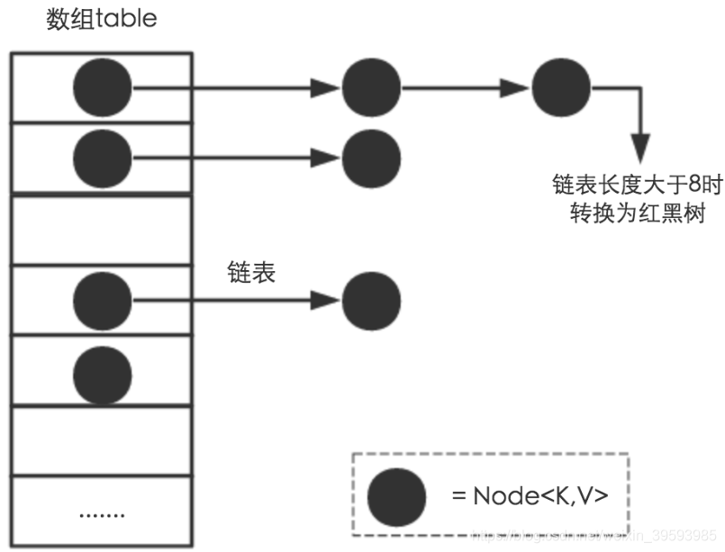
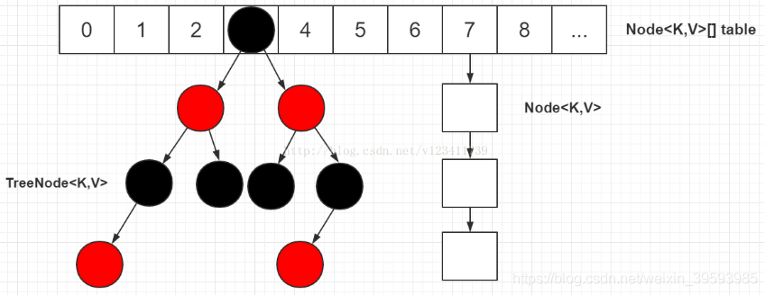
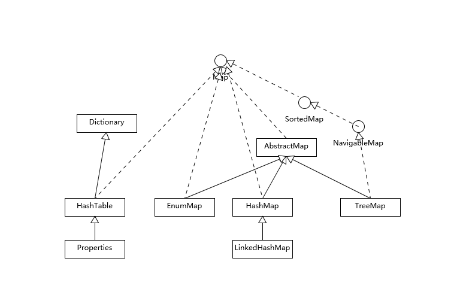
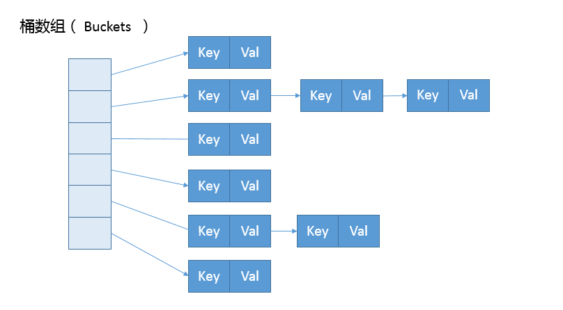

[toc]

## 09 | 对比 Hashtable、HashMap、TreeMap 有什么不同？

### 问题

-   **对比 Hashtable、HashMap、TreeMap 有什么不同**？

### 回答

-   参考文章：[https://blog.csdn.net/weixin_39593985/article/details/88219669](https://blog.csdn.net/weixin_39593985/article/details/88219669)

#### Hashtable

1.  **是线程安全的**。
2.  Java5 以后提供了 ConcurrentHashMap，它是 HashTable 的替代，比 HashTable 扩展性更好

#### HashMap

1.  **非线程安全的**。

2.  **是绝大部分利用键值对存取场景的首选**。

3.  1.7 实现方式：`数组 + 链表`

    -   

4.  1.8 实现方式：链表节点较少时以链表存在，当链表节点较多时（大于 8）会转为红黑树。

    -   
    -   

5.  HashMap 性能非常依赖于**哈希码的有效性**，请务必掌握 hashCode 和 equals 的一些基本约定。

    >   equals 相等，hashCode 一定要相等。
    >
    >   重写了 hashCode 也要重写 equals。
    >
    >   hashCode 需要保持一致性，状态改变返回的哈希值仍然要一致。
    >
    >   equals 的对称、反射、传递等特性。

#### TreeMap

1.  **非线程安全**。
2.  按照 key 从小到大排序。
3.  实现方式：红黑树
    -   

### 扩展

#### Map 整体结构

1.  类图
    
-   
    
2.  LinkedHashMap，我们构建一个**空间占用敏感的资源池**，希望自动将不常用的对象释放掉。

    -   ```java
        import java.util.LinkedHashMap;
        import java.util.Map;
        
        public class LinkHashMapSample {
            public static void main(String[] args) {
                LinkedHashMap<String, String> accessOrderedMap = new LinkedHashMap<String, String>(16, 0.75f, true) {
                    // 实现自定义删除策略，否则行为就和普遍Map没有区别
                    protected boolean removeEldestEntry(Map.Entry<String, String> eldest) {
                        System.out.println("remove Eldest Entry");
                        return size() > 3;
                    }
                };
                accessOrderedMap.put("Prj1", "Valhalla");
                accessOrderedMap.put("Prj2", "Panma");
                accessOrderedMap.put("Prj3", "Loom");
                accessOrderedMap.forEach((k,v) -> {
                    System.out.println(k + " : " + v);
                });
        
                // 模拟访问
                accessOrderedMap.get("Prj2");
                accessOrderedMap.get("Prj2");
                accessOrderedMap.get("Prj3");
                System.out.println("Iterate over should be not affected.");
                accessOrderedMap.forEach((k,v) -> {
                    System.out.println(k + " : " + v);
                });
        
                // 触发删除
                accessOrderedMap.put("Prj4", "Mis");
                System.out.println("Oldest entry should be removed.");
                accessOrderedMap.forEach((k,v) -> {
                    System.out.println(k + " : " + v);
                });
            }
        }
        ```

    -   output

    -   ```bash
        remove Eldest Entry
        remove Eldest Entry
        remove Eldest Entry
        Prj1 : Valhalla
        Prj2 : Panma
        Prj3 : Loom
        Iterate over should be not affected.
        Prj1 : Valhalla
        Prj2 : Panma
        Prj3 : Loom
        remove Eldest Entry
        Oldest entry should be removed.
        Prj2 : Panma
        Prj3 : Loom
        Prj4 : Mis
        ```

3.  TreeMap

    -   整体顺序是由键的顺序关系决定的，通过 Comparator 或 Comparable（自然顺序）来决定。

    -   compareTo 的返回值需要和 equals 一致。

    -   **TreeMap 的 put 方法实现**

    -   ```java
        
        public V put(K key, V value) {
            Entry<K,V> t = …
            cmp = k.compareTo(t.key);
            if (cmp < 0)
                t = t.left;
            else if (cmp > 0)
                t = t.right;
            else
                return t.setValue(value);
                // ...
           }
        ```

    -   

#### HashMap 源码分析

1.  源码解读，重要围绕：

    -   HashMap 内部实现基本点分析
    -   容量（capacity）和负载系数（load factor）
    -   树化

2.  HashMap 内部结构

    -   数组和链表结合组成的复合结构。

    -   当链表大小超过阈值（TREEIFY_THRESHOLD, 8），图中链表就会被改造为树形结构。

    -   数据结构图

        -   

    -   构造函数

        -   ```java
            
            public HashMap(int initialCapacity, float loadFactor){  
                // ... 
                this.loadFactor = loadFactor;
                this.threshold = tableSizeFor(initialCapacity);
            }
            
            ```

        -   HashMap 是按照 lazy-load 原则。

    -   put 方法

        -   ```java
            
            public V put(K key, V value) {
                return putVal(hash(key), key, value, false, true);
            }
            ```

    -   putVal 方法

        -   ```java
            
            final V putVal(int hash, K key, V value, boolean onlyIfAbent,
                           boolean evit) {
                Node<K,V>[] tab; Node<K,V> p; int , i;
                if ((tab = table) == null || (n = tab.length) = 0)
                    // 初始化
                    n = (tab = resize()).length;
                if ((p = tab[i = (n - 1) & hash]) == null)
                    tab[i] = newNode(hash, key, value, null);
                else {
                    // ...
                    if (binCount >= TREEIFY_THRESHOLD - 1) // -1 for first 
                       treeifyBin(tab, hash);
                    //  ... 
                 }
                // ...
                // 扩容
                if (++size > threshold)
                    resize();
            }
            
            ```

        -   resize 方法职责

            -   初始化（`tab = resize()`）
            -   扩容（`resize();`）

    -   hash 方法，为什么这里需要将高位数据移位到低位进行异或运算呢？

        -   ```java
            
            static final int hash(Object kye) {
                int h;
                return (key == null) ? 0 : (h = key.hashCode()) ^ (h >>>16;
            }
            ```

        -   **这是因为有些数据计算出的哈希值差异主要在高位，而 HashMap 里的哈希寻址是忽略容量以上的高位的，那么这种处理就可以有效避免类似情况下的哈希碰撞。**

        -   参考：[https://blog.csdn.net/v123411739/article/details/78996181#t3](https://blog.csdn.net/v123411739/article/details/78996181#t3)
        
    -   resize 方法
    
        -   ```java
            
            final Node<K,V>[] resize() {
                // ...
                else if ((newCap = oldCap << 1) < MAXIMUM_CAPACIY &&
                            oldCap >= DEFAULT_INITIAL_CAPAITY)
                    newThr = oldThr << 1; // double there
                   // ... 
                else if (oldThr > 0) // initial capacity was placed in threshold
                    newCap = oldThr;
                else {  
                    // zero initial threshold signifies using defaultsfults
                    newCap = DEFAULT_INITIAL_CAPAITY;
                    newThr = (int)(DEFAULT_LOAD_ATOR* DEFAULT_INITIAL_CAPACITY；
                }
                if (newThr ==0) {
                    float ft = (float)newCap * loadFator;
                    newThr = (newCap < MAXIMUM_CAPACITY && ft < (float)MAXIMUM_CAPACITY ?(int)ft : Integer.MAX_VALUE);
                }
                threshold = neThr;
                Node<K,V>[] newTab = (Node<K,V>[])new Node[newap];
                table = n；
                // 移动到新的数组结构e数组结构 
               }
            
            ```
    
        -   

#### 容量、负载因子和树化

