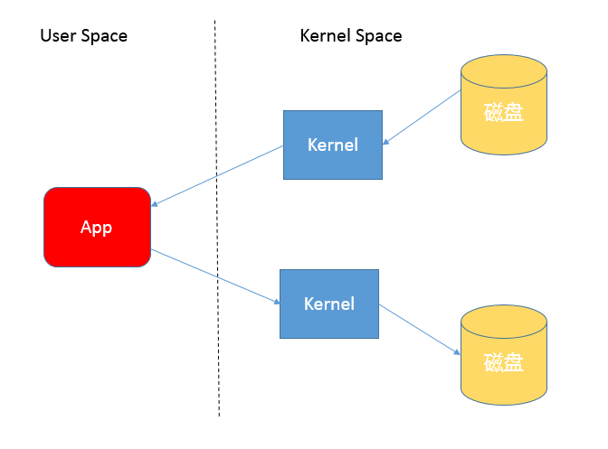

[toc]

## 12 | Java 中有几种文件拷贝方式？哪种更高效？

### 问题

-   **Java 有几种文件拷贝方式？哪种更高效？**

### 回答

1.  使用 java.io 类库提供的 FileInputStream 实现。

    -   ```java
        
        public static void copyFileByStream(File source, File dest) throws
                IOException {
            try (InputStream is = new FileInputStream(source);
                 OutputStream os = new FileOutputStream(dest);){
                byte[] buffer = new byte[1024];
                int length;
                while ((length = is.read(buffer)) > 0) {
                    os.write(buffer, 0, length);
                }
            }
         }
        
        ```

2.  使用 java.nio 类库提供的 transferTo 或 transferFrom 实现。

    -   ```java
        
        public static void copyFileByChannel(File source, File dest) throws
                IOException {
            try (FileChannel sourceChannel = new FileInputStream(source)
                    .getChannel();
                 FileChannel targetChannel = new FileOutputStream(dest).getChannel
                         ();){
                for (long count = sourceChannel.size() ;count>0 ;) {
                    long transferred = sourceChannel.transferTo(
                            sourceChannel.position(), count, targetChannel);            sourceChannel.position(sourceChannel.position() + transferred);
                    count -= transferred;
                }
            }
         }
        
        ```

3.  Java 标准类库也提供了几种 File.copy 的实现

4.  小结
    -   总体来说，NIO transferTo/From 的方式可能**更快**。
    -   它更能利用现代操作系统底层机制，避免不必要的拷贝和上下文切换。

### 分析

1.  不同的 copy 方式，底层机制有什么区别？
2.  为什么零拷贝（zero-copy）可能有性能优势？
3.  Buffer 分类与使用。
4.  Direct Buffer 对垃圾收集等方面的影响与实践选择。

### 扩展

#### 拷贝实现机制

1.  输入输出流进行读写

    -   磁盘 -> 内核缓存 -> 用户缓存
    -   

2.  基于 NIO transferTo 的实现，零拷贝技术

    -   不需要用户态参与

    -   