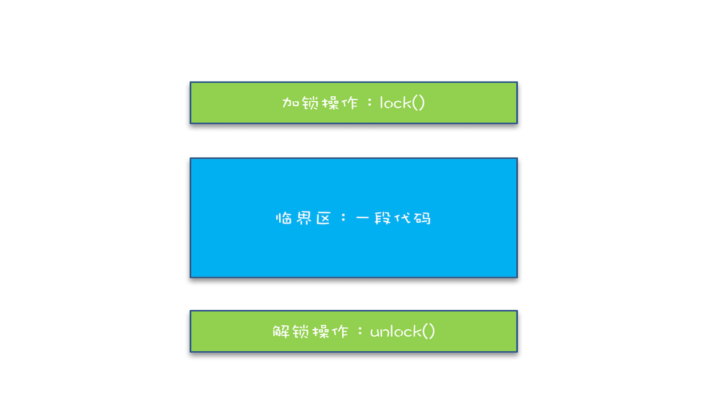
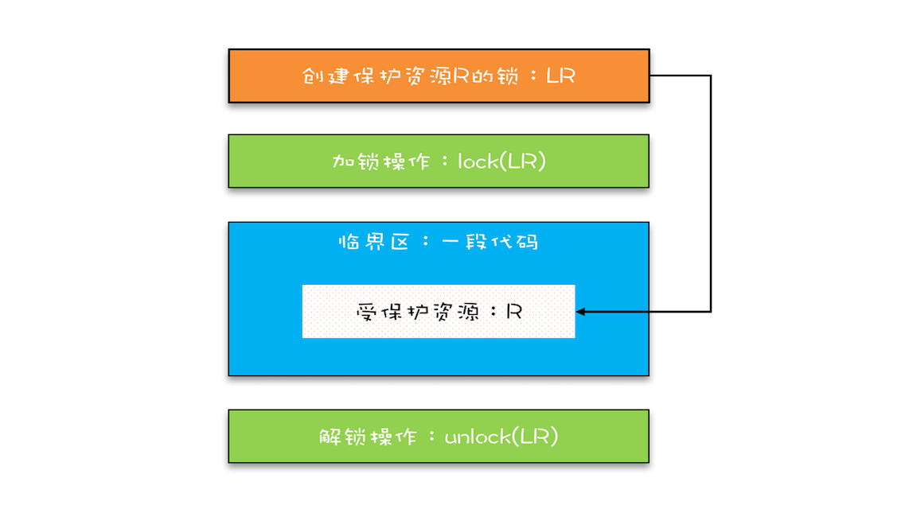

[toc]

## 03 | 互斥锁（上）：解决原子性问题

-   在第一篇文章中提到，一个或多个操作在 CPU 执行过程中不被中断的特性，称为“**原子性**”。
-   **原子性问题到底该如何解决呢？**
    -   原子性问题的源头是**线程切换**，如果能禁用线程切换那不就能解决这个问题了吗？
    -   操作系统做线程切换是依赖 CPU 中断的，所以禁止 CPU 中断就能够禁止线程切换。
-   “**同一时刻只有一个线程执行**， 我们称为**互斥**。如果我们能保证对共享变量的修改是互斥的，那么，无论是单核 CPU 还是多核 CPU，就都能保证原子性了。

### 简易锁模式

-   当谈到互斥，一定会想到的解决方案：**锁**。模型如下：
    -   
-   如上，我们忽视了两个非常非常重要的点：**我们锁的是什么？我们保护的又是什么？**

### 改进后的锁模型

-   锁和锁要保护的资源是有对应关系的。完善后的模型如下：
    -   
-   首先，我们要把临界区要保护的资源标注出来，如图中临界区里增加了一个元素。
-   其次，我们要保护资源，就得为它创建一把锁。
-   最后，针对这把锁，我们还需要在进出临界区时添上加锁操作和解锁操作。
-   另外，**在锁和受保护资源间，我特地用一条线做了关联**。这个关联非常重要。

### Java 语言提供的锁技术：synchronized

-   Java 提供 synchronized，就是锁的一种实现。synchronized 关键字可以用来修饰方法，也可以修饰代码块。如下：

    -   ```java
        
        class X {
          // 修饰非静态方法
          synchronized void foo() {
            // 临界区
          }
          // 修饰静态方法
          synchronized static void bar() {
            // 临界区
          }
          // 修饰代码块
          Object obj = new Object()；
          void baz() {
            synchronized(obj) {
              // 临界区
            }
          }
        }  
        ```

-   修饰代码块的时候，锁定的是 obj 对象，那修饰方法时，锁定的是什么呢？这个也是 Java 的一条隐式规则：

    >   当修改静态方法的时候，锁定的是当前类的 Class 对象，上例中就是 Class X。
    >
    >   当修饰非静态方法的时候，锁定的是当前实例对象 this。

-   修饰静态方法：

    -   ```java
        
        class X {
          // 修饰静态方法
          synchronized(X.class) static void bar() {
            // 临界区
          }
        }
        ```

-   修饰非静态方法

    -   ```java
        
        class X {
          // 修饰非静态方法
          synchronized(this) void foo() {
            // 临界区
          }
        }
        ```

#### 用 synchronized 解决 count+=1 问题

-   对 addOne() 加锁，保证原子性，对 get() 加锁，保证可见性。代码如下：

    -   ```java
        
        class SafeCalc {
          long value = 0L;
          synchronized long get() {
            return value;
          }
          synchronized void addOne() {
            value += 1;
          }
        }
        ```

-   转换为锁模型，如下图。get() 和 addOne() 方法都需要访问 value 这个受保护的资源，这个资源用 this 这把锁来保护。

    -   

### 锁和受保护资源的关系

-   一个合理的关系是：**受保护资源和锁之间的关联是 N:1 的关系**。

-   对上面例子做了发动，把 value 改成静态变量，把 addOne() 方法改成静态方法。

    -   ```java
        
        class SafeCalc {
          static long value = 0L;
          synchronized long get() {
            return value;
          }
          synchronized static void addOne() {
            value += 1;
          }
        }
        ```

-   如里仔细观察，就会发现改动后的代码是两个锁保护一个资源。这个受保护的资源就是静态变量 value，两个锁分别是 this 和 SafeCalc.class。模型图如下：

    -   
    -   由于临界区是用两个锁保护，因此两个临界区没有互斥关系。addOne() 对 value 的修改对 get() 没有可见性保证，这就导致并发问题了。

### 总结

-   **互斥锁**在并发领域知名极高，只要有了并发问题，大家很容易想到的就是加锁。因为锁能够保证执行临界区的代码的互斥性。
-   上面，理解虽然正确，但是却不能指导你真正用好互斥锁。所以，**必须深入分析锁定的对象和受保护资源的关系，综合考虑受保证资源的访问路径，多方面考量才能用好互斥锁**。
-   synchronized 是 Java 在语言层面提供的互斥原语，与其他互斥锁，原理都是相通的：“**锁，一定要有一个锁定的对**象”，至于这个锁定的对象要保护的资源及在哪里加锁/解锁，就属于设计层面的事了。