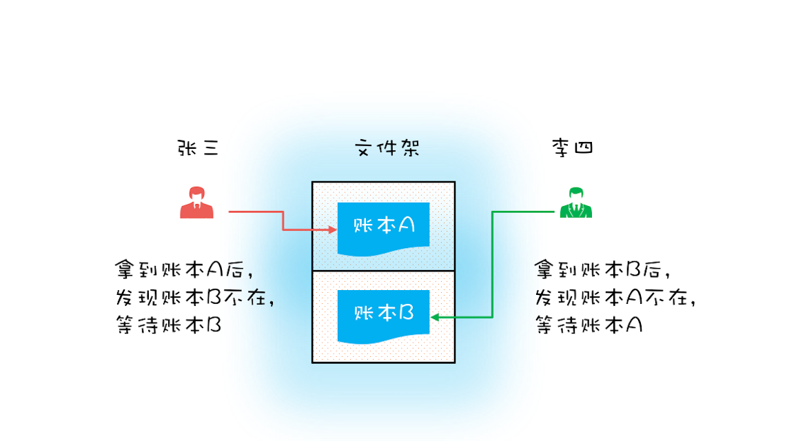

[TOC]

## 05 | 一不小心就死锁了，怎么办？

-   上节中，我们用 Account.class 作为互斥锁，来解决银行转账问题，所有账户的转账都是串行的。如账户 A 转账户 B、账户 C 转账户 D，都被串行化了，性能太差了。

### 向现实世界要答案

-   现实世界里，账户转账操作是支持并发的，而且绝对是真正的并行。

-   在编程世界里，其实是用两把锁就实现了，转出账本一把，转入账本一把。我们首先尝试锁定转出账户 this，然后尝试锁定转入账户 target，只有当两者都成功时，才执行转账操作。模型图如下：“两个转账操作并行示意图”

    -   

-   代码实现，如下：

    -   ```java
        
        class Account {
          private int balance;
          // 转账
          void transfer(Account target, int amt){
            // 锁定转出账户
            synchronized(this) {              
              // 锁定转入账户
              synchronized(target) {           
                if (this.balance > amt) {
                  this.balance -= amt;
                  target.balance += amt;
                }
              }
            }
          } 
        }
        ```

    -   

### 没有免费的午餐

-   上面实现看上去很完美，我们锁定的范围小多了。这样的锁，我们上节叫：**细粒度锁，使用细粒度锁可以提高并行度，是性能优化的一个重要手段。**
-   **使用细粒度锁是有代价的，这个代价就是可能会导致死锁。**
    -   
-   死锁的一个比较专业的定义：**一组互相竞争资源的线程因互相等待，导致“永久”阻塞的现象。**
-   关于这种现象，我们还可以借助**资源分配图**来可视化锁的占用情况。
    -   

### 如何预防死锁

-   分析**死锁发生条件**： -- Coffman
    1.  互斥
    2.  占有且等待
    3.  不可抢占
    4.  循环等待
-   反过来分析，**也就是只要我们破坏其中一个，就可以成功避免死锁的发生。**
-   除了互斥我们没办法破坏，因为我们用锁为的就是互斥。其他三个都有有办法破坏掉的。
    1.  对于“**占用且等待**”这个条件，我们可以**一次性申请所有资源**，这样就不存在等待了。
    2.  对于“**不可抢占**”这个条件，占用部分资源的线程进一步申请其他资源时，**如果申请不到，可以主动释放它占有的资源**，这样不可抢占这个条件就破坏掉了。
    3.  对于“**循环等待**”这个条件，**可以靠按序申请资源来预防**。所谓按序申请，是指有线性顺序的，申请的时候可以先申请资源序号小的，再申请资源序号大的，这样线性化后，自然就不存在循环了。

#### 1. 破坏占用且等待条件

-   理论上，要破坏这个条件，可以**一次性申请所有资源**。

-   拿我们前面我们提到的转账操作来讲。可以增加一个账本管理员，当申请资源，账本管理员只有在所有资源同时都存在的时候，才会分配资源给程序。这样就保证了“一次性申请所有资源”。

    -   通过账本管理员拿账本
    -   

-   对应到编程领域，“同时申请”这个操作是一个临界区，我们也需要一个角色来管理这个临界区，我们就把这个角色定为 Allocator。它主要有两个功能：同时申请资源 apply() 和同时释放资源 free()。账户 Account 类里持有一个 Allocator 的单例。代码如下：

    -   ```java
        
        class Allocator {
          private List<Object> als =
            new ArrayList<>();
          // 一次性申请所有资源
          synchronized boolean apply(
            Object from, Object to){
            if(als.contains(from) ||
                 als.contains(to)){
              return false;  
            } else {
              als.add(from);
              als.add(to);  
            }
            return true;
          }
          // 归还资源
          synchronized void free(
            Object from, Object to){
            als.remove(from);
            als.remove(to);
          }
        }
        
        class Account {
          // actr应该为单例
          private Allocator actr;
          private int balance;
          // 转账
          void transfer(Account target, int amt){
            // 一次性申请转出账户和转入账户，直到成功
            while(!actr.apply(this, target))
              ；
            try{
              // 锁定转出账户
              synchronized(this){              
                // 锁定转入账户
                synchronized(target){           
                  if (this.balance > amt){
                    this.balance -= amt;
                    target.balance += amt;
                  }
                }
              }
            } finally {
              actr.free(this, target)
            }
          } 
        }
        ```

    -   

#### 2. 破坏不可抢占条件

-   核心是要能够**主动释放它占有的资源**。
-   这一点 synchronized 是做不到的。原因是 synchronized 申请资源的时候，如果申请不到，纯种直接进行阻塞状态了，而线程进行阻塞状态，啥都干不了，也释放不了线程已经占有的资源。
-   Java 在语言层次确实没有解决这个问题，不过在 SDK 层面还是解决了的 **java.util.concurrent** 这个包下面提供的 Lock 是可以轻松解决这个问题的。

#### 3.  破坏循环等待条件

-   **破坏这个条件，需要对资源进行排序，然后按序申请资源。**

-   如下代码中，1~6处的代码对转出账户 this 和转入账户 target 排序，然后按序号从小到大的顺序锁定账户。这样就不存在“循环”等待了。

    -   ```java
        
        class Account {
          private int id;
          private int balance;
          // 转账
          void transfer(Account target, int amt){
            Account left = this        ①
            Account right = target;    ②
            if (this.id > target.id) { ③
              left = target;           ④
              right = this;            ⑤
            }                          ⑥
            // 锁定序号小的账户
            synchronized(left){
              // 锁定序号大的账户
              synchronized(right){ 
                if (this.balance > amt){
                  this.balance -= amt;
                  target.balance += amt;
                }
              }
            }
          } 
        }
        ```

### 总结

-   当我们在编程世界里遇到问题时，可以换个思路。
    -   **利用现实世界的模型来构思解决方案**。

-   今天，我们主要讲了**用细粒度锁来锁定多个资源时，要注意死锁的问题**。**识别出风险很重要**。
-   有时候，预防死锁成本也是很高的。有转账这个例子中，破坏循环等待条件是成本最低的一个方案。
-   所以，我们在选择具体方案的时候，还需要**评估一下操作成本，从中选择一个成本最低的方案**。