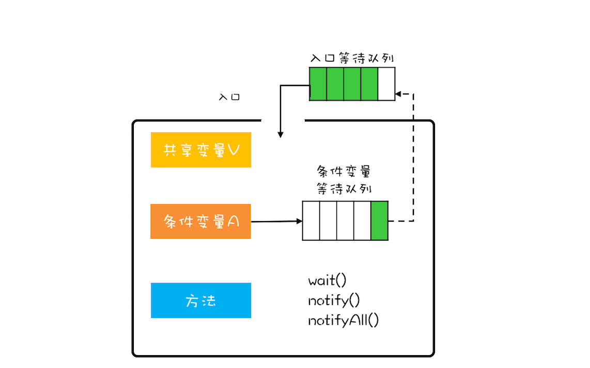

[toc]

## 08 | 管程：并发编程的万能钥匙

### 什么是管程

1.  Java 里的 synchronized 关键字及 wait()、notify()、notifyAll() 三个方法都是管程的组成部分。
2.  **管程和信号量是等价的**：管程能实现信号量，信号量也能实现管程。 
3.  **管程**
    -   对应英文是 Monitor，操作系统领域一般都翻译成“管程”。
    -   **指的是管理共享变量及对共享变量的操作过程，让他们支持并发**。也就是管理类的成员变量和成员方法，让这个类**线程安全**。

### MESA 模型

1.  三种管程模型
    -   Hasen 模型
    -   Hoare 模型
    -   **MESA 模型**
2.  并发编程领域，两大核心问题：
    -   **互斥**，同一时刻，只允许一个线程访问共享资源。
    -   **同步**，线程间如何通信、协作。

#### 管程如何解决**互斥**问题的？

1.  思路：**将共享变量及其对共享变量的操作统一封装起来**。

2.  管程模型和**面向对象**高度契合。

3.  **互斥锁**背后的模型就是管程。

4.  例：如果要实现一个线程安全的阻塞队列，一个最直观的想法就是：**将线程不安全的队列封装起来，对外提供线程安全的操作方法**。
    -   

#### 管程如何解决**同步**问题的？

1.  管程还引入了**条件变量**的概念，而且**每个条件变量都对应有一个等待队列**。如下图：
    -   
2.  条件变量和条件变量等待队列的**作用**是什么呢？
    -   就是解决**线程同步**问题。

#### 用管程实现一个线程安全的阻塞队列

1.  阻塞队列的两个操作分别是**入队**和**出队**，这两个方法都是**先获取互斥锁**，类比管程模型中的入口。

    -   **阻塞入队**，如果阻塞队列已满，就需要等待，直到队列不满。这里用 notFull.await()。
    -   **阻塞出队**，如果阻塞队列为空，就需要等待，直到阻塞队列不空。这里用 notEmpty.await()。
    -   **入队成功**，阻塞队列就不空了，就需要通知条件变量：notEmpty 对应的等待队列。
    -   **出队成功**，阻塞队列就不满了，就需要通知条件变量：notFull 对应的等待队列。

2.  代码

    -   ```java
        
        public class BlockedQueue<T>{
          final Lock lock =
            new ReentrantLock();
          // 条件变量：队列不满  
          final Condition notFull =
            lock.newCondition();
          // 条件变量：队列不空  
          final Condition notEmpty =
            lock.newCondition();
        
          // 入队
          void enq(T x) {
            lock.lock();
            try {
              while (队列已满){
                // 等待队列不满 
                notFull.await();
              }  
              // 省略入队操作...
              //入队后,通知可出队
              notEmpty.signal();
            }finally {
              lock.unlock();
            }
          }
          // 出队
          void deq(){
            lock.lock();
            try {
              while (队列已空){
                // 等待队列不空
                notEmpty.await();
              }
              // 省略出队操作...
              //出队后，通知可入队
              notFull.signal();
            }finally {
              lock.unlock();
            }  
          }
        }
        ```

    -   **await() 和 wait() 语义一样。signal() 和 notify() 语义一样**。

### wait() 的正确姿势

1.  **MESA 特有**的一个编程范式，需要**在一个 while 循环里调用 wait()**。

    -   ```java
        
        while(条件不满足) {
          wait();
        }
        ```

### notify() 何时可以使用

1.  前面章节，曾介绍过。**除非经过深思熟虑，否则尽量使用 notifyAll()**。那什么时候可以使用 notify() 呢？需要满足下面三个条件：
    -   所有等待拥有**相同的等待条件**。
    -   所有等待线程被唤醒后，**执行相同的操作**。
    -   只需要唤醒**一个**线程。

### 总结

1.  管程是一个**解决并发问题的模型**，理解这个模型的重点在于**理解条件变量及其等待队列的工作原理**。
2.  Java 语言内置的管程（synchronized）对 MESA 模型进行了精简：Java 语言内置的管程里只有一个条件变量。如下图所示：
    -   
3.  并发编程里两大核心问题：**互斥**和**同步**，都可以由管程来帮你解决。学好管程，理论上，所有并发问题你都可以解决，并且很多并发工具类底层都是管程实现的。

