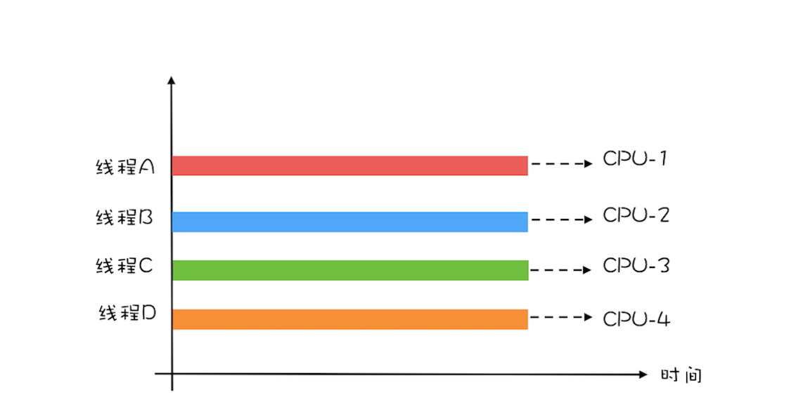

[toc]

## 10 | Java 线程（中）：创建多少线程才是合适的？

-   首要分析以下两个问题：
    1.  为什么要使用线程？
    2.  多线程的应用场景有哪些？

### 为什么要使用多线程

1.  使用多线程，本质上就是**提升程序性能**。
2.  度量性能指标
    -   **延迟**：发出请求到收到响应这个过程的时间。
    -   **吞吐量**：单位时间内能处理请求的数量。
3.  多线程的主要目的：**降低延迟、提高吞吐量**。

### 多线程的应用场景

1.  “**降低延迟、提高吞吐量**”的方向基本上有两个：
    -   **优化算法**
    -   **将硬件的性能发挥到极致**
2.  计算机主要有哪些硬件呢？
    -   I/O
    -   CPU
3.  操作系统解决硬件利用率问题的对象往往是单一的硬件设备。**我们需要解决 CPU 和 I/O 设备综合利用率的问题。**

#### 如何利用多线程来提升 CPU 和 I/O 设备的利用率？

1.  假设程序按 CPU 和 I/O 操作交叉的方式运行，它们**耗时比是 1:1**。
2.  单线程情况下，CPU 和 I/O 设备利用率都是 50%。
    -   单线程示意图
    -   
3.  两个线程时，CPU 和 I/O 利用率都达到 100%。
    -   二个线程示意图
    -   
4.  可以看出：单位时间处理的请求数量翻了一番。逆向思维下：**如果 CPU 和 I/O 设备的利用率都很低，那么可以尝试通过增加线程来提高吞吐量。**
5.  4 核的 CPU 上利用 4 个线程执行
    -   

### 创建多少线程合适？

1.  创建多个线程，要看具体的应用场景。

2.  对于 CPU 密集型计算

    -   每个核一个线程就可以了。
    -   理论上“**线程的数量 = CPU 核数**” 最合适。不过工程上，线程数量一般会设置为“**CPU 核数 + 1**”

3.  对于 I/O 密集型计算

    -   CPU 和 I/O 耗时 1:1 时，2 个线程最合适。

    -   CPU 和 I/O 耗时 1:2 时，3 个线程最合适。 如下图：

        -   三线程执行示意图
        -   

    -   单核 CPU 时的计算公式：

        >   **最佳线程数 = 1 +（I/O 耗时 / CPU 耗时）**

    -   多核 CPU 时的计算公式：

        >   **最佳线程数 = CPU 核数 * [ 1 +（I/O 耗时 / CPU 耗时）]**

### 总结

1.  上面这些最佳公式，背后的原则其实就是：**将硬件的性能发挥到极致**。
2.  对于 CPU 和 I/O 耗时的比值，我们需要去估算，然后做不同场景下的压测来验证我们的估计。
3.  原则还是**将硬件的性能发挥到极致**，压测时，我们需要重点关注 CPU、I/O 设备利用率和性能指标（响应时间、吞吐量）间的关系。

### 扩展

1.  有些同学认为，对于 I/O 密集型应用，最佳线程数计算公式：

    >   2 * CPU 核数 + 1  

2.  如没有特殊需求，可以借鉴这个公式来计算。